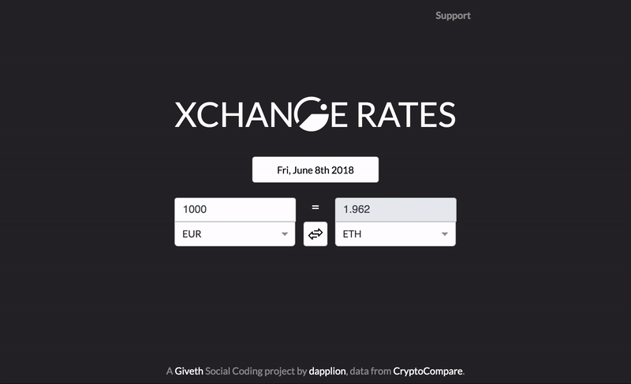

## Xchange Rates

The Crypto Fiat Exchange Rate is a tool that gives any exchange rate provided by cryptocompare at any given day. It is aimed at people willing to justify a payment as
you can get a link that will load the specific pair and date and value that you selected.

### Live website:
[https://giveth.github.io/xchange-rates/](https://giveth.github.io/xchange-rates/)

  

